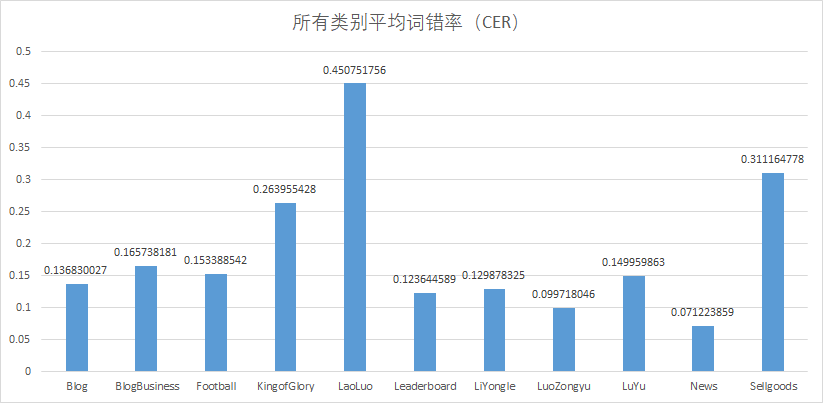

# wav2vec2/hubert 语音识别http接口服务器


## Quick start
Docker hub: [https://hub.docker.com/r/lovemefan/whisper-webserver](https://hub.docker.com/r/lovemefan/wav2vec2-webserver)
```bash
# for gpu
docker run -d --gpus all -p 8080:8080  lovemefan/wav2vec2-webserver:latest
```

## CER
### 中文模型
在评测数据集[SpeechIO](https://github.com/SpeechColab/Leaderboard)
上字错率如下图。

该中文模型在完全端到端的wav2vec2-large模型没有语言模型下的评测结果如下：


###  越南语识别
使用基于wav2vec2 [开源模型](https://github.com/vietai/ASR)， **注意：不可商用**

|VIVOS	|COMMON VOICE VI|VLSP-T1|VLSP-T2|
|---|---|---|---|
|WER|	10.77|	18.34|	13.33|	51.45|

## 当前功能
* 中文语音识别功能: 给定中文语音识别为中文文本
* 中文语音文本对齐：给定中文语音与文本，输出时间锚点信息
* 越南语语音识别功能: 给定中越南语音识别为越南语文本
* 越南语音文本对齐：给定越南语语音与文本，输出时间锚点信息

## 项目结构
```bash
├── backend
│   ├── config
│   │   ├── BaseConfig.py
│   │   ├── config.ini
│   │   ├── Config.py
│   │   ├── config.yml
│   ├── decorator
│   │   ├── mysql.py
│   │   └── singleton.py
│   ├── Dockerfile
│   ├── exception
│   │   ├── InvalidSystemClock.py
│   │   └── SpeechException.py
│   ├── model
│   │   └── ResponseBody.py
│   ├── requirements.txt
│   ├── routes
│   │   ├── app.py
│   │   ├── banner.txt
│   │   └── recognitionRoute
│   │       └── RecognitionRoute.py
│   ├── scripts
│   │   ├── alimeeting-process.py
│   │   ├── cut_files.py
│   │   ├── magicData-RMAC-process.py
│   │   └── run-dev.sh
│   ├── service
│   │   └── recognitionService
│   │       ├── hubert
│   │       ├── infer.py
│   │       ├── ours
│   │       │   └── zh
│   │       │       ├── infer.py
│   │       │       ├── RecognitionService.py
│   │       │       └── Wav2vec2ZhRecognitionService.py
│   │       ├── RecognitionService.py
│   │       ├── SegmentService.py
│   │       ├── TransformersBase.py
│   │       └── w2v2
│   │          └── vi
│   │               └── W2v2ViRecognitionService.py
│   ├── user_api.md
│   └── utils
│       ├── AudioReader.py
│       ├── common.py
│       ├── logger.py
│       ├── md5Utils.py
│       ├── snowflake.py
│       ├── StatusCode.py
│       └── viterbi.py
├── Dockerfile
├── fairseq_lib
├── readme.md
├── res
│   └── speechIO-CER.png
└── w2v2-fairseq-model
    ├── checkpoint_best.pt
    ├── configs
    │   ├── fine-tuning.sh
    │   ├── infer_char.sh
    │   ├── infer_char_with_kenlm.sh
    │   ├── output
    │   ├── prepared_data.sh
    │   ├── utils
    │   └── wav2vec2_finetuning.yaml
    ├── dict.ltr.txt
    └── tensorboard    
```

## 部署
从源码构建
中文模型基于fairseq的wav2vec2-large 在wenetspeech 10000h的[预训练模型](https://github.com/TencentGameMate/chinese_speech_pretrain)，在约两千小时的开源语料微调得到(后续开源)
越南语模型来自于[开源模型](https://github.com/vietai/ASR)。
### 1. 下载源码以及模型
```bash
# 下载代码
git clone https://github.com/lovemefan/Wav2vec2-webserver.git
cd Wav2vec2-webserver
```

### 2. 修改配置文件 `/backend/config/config.ini`
以下参数必填
```ini
[wav2vec2-zh-fairseq]
;是否开启
enable = true
; 只有当cpu值为true 使用cpu解码
cpu = false
;dict存放路径
data = /w2v2-fairseq-model
;checkpoint 路径
path = /w2v2-fairseq-model/checkpoint_best.pt
;粒度， 词表由 path和labels 组成
labels = ltr

[wav2vec-vi-transformers]
;是否开启
enable = true
; 只有当cpu值为true 使用cpu解码
cpu = false
; 本地文件路径或Hugging Face路径: nguyenvulebinh/wav2vec2-base-vietnamese-250h
model=/dataset/speech/pre-trained-models/transformers/wav2vec2-base-vietnamese-250hv
```
### 3. 构建docker镜像
需要根据需求修改Dockerfile

```bash
sudo docker build -t w2v2-webserver .
```

### 4. 创建容器

```bash
# 自行更改端口
sudo docker run -d -e "PORT=8080"--name w2v2-webserver -p8080:8080 w2v2-web:latest
```

### 5. 接口请求
#### 5.1 识别接口
语音文件格式要求采样率为16kHz,采样位宽为16bit，单通道的wav格式的音频。

|参数|描述|示例|
|---| --- | ---|
|audio|上传文件|test.wav|
|language|语音代码目前支持[zh,vi]|zh|

```bash
curl --location --request POST 'http://localhost:8090/v1/api/speech/recognition' \
--form 'audio=@F:\语料\aishell\data_aishell\wav\S0002\train\S0002\BAC009S0002W0122.wav' \
--form 'language=zh'
```

返回结果

```json
{
	"message": "Success",
	"status_code": "RECOGNITION_FINISHED",
	"code": 200,
	"data": "而对面楼市成交抑制作用最大的限购"
}
```

#### 5.2对齐接口
文本以句号、问号、感叹号、双引号为分句标志，输出以句子粒度的对齐结果。

|参数|描述|示例|
|---| --- | ---|
|audio|上传文件|test.wav|
|text|给定待对齐文本|你好|
|language|语音代码目前支持[zh,vi]|zh|

```bash
curl --location --request POST 'http://localhost:8080/v1/api/speech/segment' \
--form 'audio=@F:\语料\aishell\data_aishell\wav\S0002\train\S0002\BAC009S0002W0122.wav' \
--form 'text=而对面楼市成交抑制作用最大的限购。' \
--form 'language=zh'
```

返回结果

```json
{
	"message": "Success",
	"status_code": "RECOGNITION_FINISHED",
	"code": 200,
	"data": [
		{
			"start": 0.2808896321070234,
			"end": 5.527506688963211,
			"score": -0.6467344031540316,
			"text": "而对面楼市成交抑制作用最大的限购。"
		}
	]
}
```
